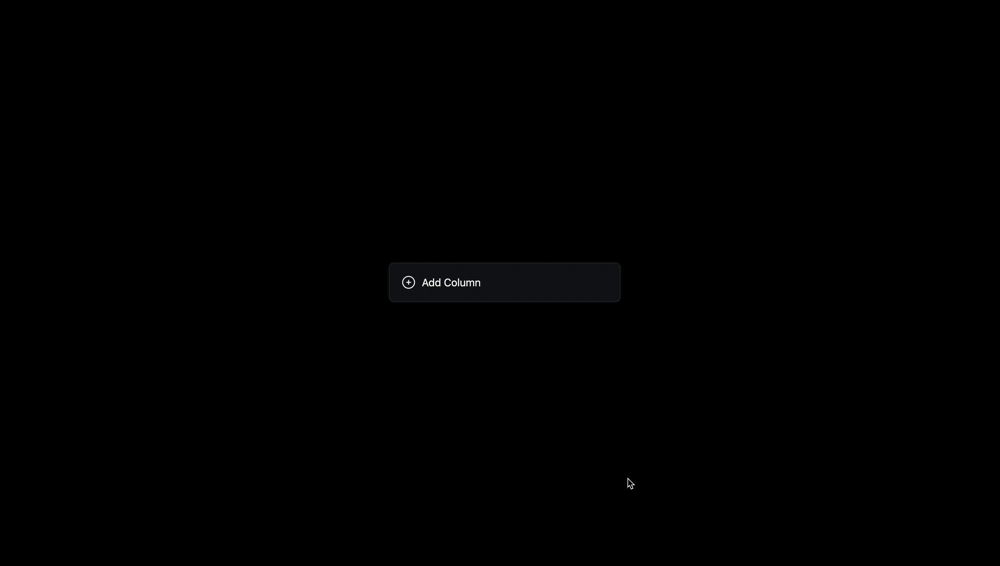

# Kanban Board with React & DnD-kit

Experience the power of organization and task management with our Kanban Board built using React, TypeScript, Tailwind CSS, and DnD-kit. Manage your tasks and projects seamlessly with an intuitive drag-and-drop interface.



## ⚙️ Technology Stack

- **React with Vite:** Fast development and efficient bundling.
- **TypeScript:** Robust type safety for scalable UI components.
- **Tailwind CSS:** Utility-first framework for customizable styling.
- **Dnd-kit:** Modern drag-and-drop toolkit for React.

## Features

- **Columns Management:** Create, edit, and delete columns.
- **Task Management:** Add, update, and delete tasks.
- **Drag & Drop:** 
  - Rearrange tasks within a column.
  - Move tasks across different columns.

## How to Run Locally

1. **Ensure you have Node.js and npm installed.**

2. **Clone the repository:**

   ```bash
   git clone https://github.com/Nazarkooo/TodoReact.git
   cd to-do-react
   ```

3. **Install dependencies:**

   ```bash
   npm install
   ```

4. **Start the development server:**

   ```bash
   npm run dev
   ```

5. **Open your browser and navigate to:**

   ```
   http://localhost:5173
   ```

### Thank You for Checking Out the Project!
